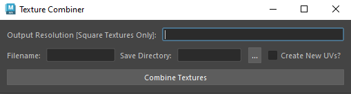

# Paint Game Converter
Plugin built for my Powerwash Simulator-like [painting game.](https://github.com/JohnSchrullLopez/PaintSim)
Converts an object with multiple materials into a single material with a single color and normal texture with UVs compatible with the game.

## How To Use
Select an object that has materials applied in Maya, select a size for the resulting textures (e.g. for a 2048x2048 texture, enter 2048), pick a name for the output texture, select a destination for the output textures, check the box if new UVs need to be generated, then click Combine Textures.

## Generate UVs
Option for auto-generating UVs to remove any overlap and fit into the 0-1 space.

## Transfer Textures
Transfers textures from the unconverted mesh into a single color and normal texture.
